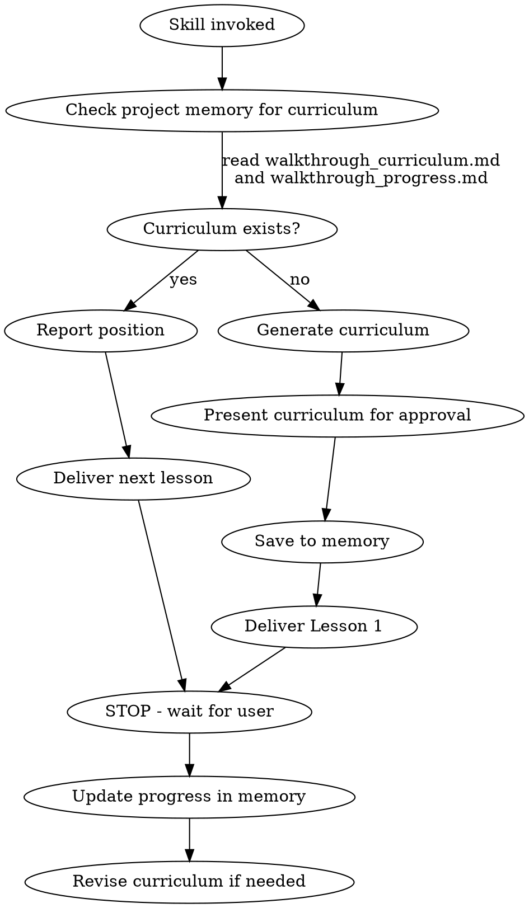

# Code Walkthrough

Deliver structured, guided tours of any codebase — or a specific part of one —
with progress tracking across sessions. The curriculum provides logical
structure and a progress bookmark.

## Core Rule

**NEVER dump the entire codebase explanation in one response.** Deliver one
lesson at a time, then STOP and wait for the user to direct pacing.

## Curriculum Structure

Two-level hierarchy:

- **Lessons** — high-level topics or modules (e.g. "Data Layer", "Pipeline
  Orchestration"). Generated up front from dependency analysis.
- **Tasks** — individual files, functions, or code blocks within a lesson.
  Populated as each lesson begins, based on what the code actually contains.

The number of lessons scales with codebase size and complexity — a small
library might have 3 lessons, a large application might have 20+.

## Workflow



### Scoped Walkthroughs

The user may request a walkthrough of the full codebase or a specific part
(a directory, module, or cross-cutting concern). When scoped, apply the same
workflow but only to files within scope. Note dependencies outside scope as
"external to this walkthrough" in lesson openings. Use a distinct curriculum
file name (e.g. `walkthrough_curriculum_pipeline.md`) so scoped and full
walkthroughs don't overwrite each other.

### First Invocation (no curriculum in memory)

1. **Survey the codebase** (or scoped subset). Use Glob and Grep to discover
   structure, entry points, config files, source directories, and test
   directories.
2. **Trace dependencies.** Grep for import/require/use statements to build an
   internal dependency map. Follow the algorithm in
   `references/curriculum-design.md`.
3. **Generate curriculum.** Produce an ordered list of lessons (topics). For
   each lesson, list the files involved but defer detailed task breakdown until
   delivery. Present the curriculum and ask: *"Here is the lesson plan. Want to
   adjust the order, skip sections, or add focus areas?"*
4. **Save to project memory.** Write `walkthrough_curriculum.md` and
   `walkthrough_progress.md` to the project memory directory.
5. **Deliver Lesson 1** immediately after the user approves.

### Subsequent Invocations (curriculum exists)

1. Read `walkthrough_curriculum.md` and `walkthrough_progress.md` from project
   memory.
2. Report: *"You've completed N of M lessons. Next up: [title]. Ready to
   continue, or want to review a past lesson or adjust the plan?"*
3. Deliver the next incomplete lesson.

### Starting a Lesson

When beginning a lesson, read the relevant files and break the lesson into
specific **tasks** (individual files, key functions, or code blocks). List
these tasks explicitly at the start of the lesson so the user can see the
breakdown. Update the curriculum in memory with these tasks so progress is
granular — if the user stops mid-lesson, you know exactly which tasks are
done.

## Lesson Format

### 1. Opening (2-3 sentences)
What this lesson covers, why it matters in the architecture, and what the user
should understand by the end.

### 2. Guided Code Reading
Walk through the lesson's tasks in logical order. For each:
- **Link to specific lines** using relative paths from project root:
  `[filename.py:42](src/filename.py#L42)` — never use absolute paths in links
- Explain what the code does and WHY it exists
- Connect to concepts from previous lessons
- Highlight non-obvious design decisions or patterns

Spend time on genuinely complex or architecturally significant parts. For
straightforward code, say so briefly and move on. Read the actual code and
explain what IS there, don't speculate.

### 3. Wrap-Up
- Summarize key takeaways as bullet points
- State what the next lesson will cover and how it connects
- **STOP.** Wait for the user to say "next", "go deeper", "skip ahead", etc.

After the user is ready to move on:
- Update `walkthrough_progress.md` in memory (mark lesson and tasks complete)
- If the lesson revealed that upcoming lessons need restructuring, update
  `walkthrough_curriculum.md` too

## Curriculum Revision

The curriculum is a living document. Revise it when:
- A lesson turns out too large or too small during delivery
- The user asks to add, remove, or reorder lessons
- Completing a lesson reveals later lessons need restructuring
- New areas of interest emerge during discussion

Always update the memory file when revising.

## Handling User Requests

| Request | Action |
|---------|--------|
| "Skip this" | Mark complete, deliver next |
| "Go deeper" | Expand current section with more code detail |
| "I already know this" | Skip to next lesson |
| "Let's stop here" | Update progress, summarize resume point |
| "Go back to lesson N" | Re-deliver that lesson |
| "Change the plan" | Revise curriculum, save to memory |

## Memory Schema

Both files live in the project memory directory.

### walkthrough_curriculum.md
```markdown
---
name: walkthrough_curriculum
description: Code walkthrough lesson plan for [project name]
type: project
---

# Code Walkthrough Curriculum

**Project:** [name]
**Generated:** [date]
**Last revised:** [date]

## Lesson 1: [Title]
**Files:** [list of files involved]
**Concepts:** [key ideas introduced]
**Prerequisites:** none
### Tasks (populated when lesson begins)
- [ ] [file or function 1]
- [ ] [file or function 2]

## Lesson 2: [Title]
**Files:** [list]
**Concepts:** [key ideas]
**Prerequisites:** Lesson 1
### Tasks
- [ ] ...
...
```

### walkthrough_progress.md
```markdown
---
name: walkthrough_progress
description: Progress tracker for code walkthrough of [project name]
type: project
---

# Walkthrough Progress

**Started:** [date]
**Last session:** [date]
**Completed:** [N] of [M] lessons

## Completed Lessons
- [x] Lesson 1: [Title] -- [date]

## Current Position
Next lesson: [N]

## User Notes
[Preferences, areas of interest, depth adjustments noted during sessions]
```

## Red Flags -- STOP If You Catch Yourself

- Explaining more than one lesson's worth of code without stopping
- Not saving progress to memory after a lesson
- Not providing clickable file:line links
- Dumping a wall of code without explanation
- Moving to the next lesson without the user directing you to
- Using absolute paths in file links instead of relative paths from project root
